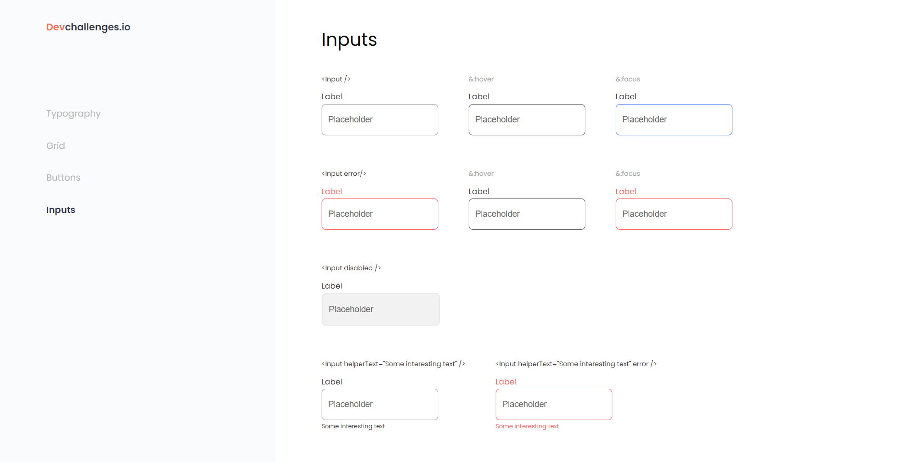

<!-- Please update value in the {}  -->

<h1 align="center">Button Component</h1>

   Solution for a challenge from  <a href="http://devchallenges.io" target="_blank">Devchallenges.io</a>.

  <h3>
    <a href="https://input-component-challenge.netlify.app">
      Demo
    </a>
     | 
    <a href="https://github.com/wenadev/devchallenges-io/tree/main/Front-end/inputcomponent">
      Solution
    </a>
     | 
    <a href="https://devchallenges.io/challenges/TSqutYM4c5WtluM7QzGp">
      Challenge
    </a>
  </h3>

<!-- TABLE OF CONTENTS -->

## Table of Contents

- [Overview](#overview)
  - [Built With](#built-with)
- [Features](#features)
- [Contact](#contact)
- [Acknowledgements](#acknowledgements)

<!-- OVERVIEW -->

## Overview

### Built With

<!-- This section should list any major frameworks that you built your project using. Here are a few examples.-->

- [Reactjs](https://reactjs.org/)
- [Material.io](https://material.io/)

## Features

<!-- List the features of your application or follow the template. Don't share the figma file here :) -->

This application/site was created as a submission to a [DevChallenges](https://devchallenges.io/challenges) challenge. The [challenge](https://devchallenges.io/challenges/ohgVTyJCbm5OZyTB2gNY) was to build an application to complete the given user stories.

## Contact

- Hashnode [@wenadev](https://wenadev.hashnode.dev/?guid=1b4520e7-551b-4696-84ee-7378be2a0ff3&deviceId=3034ca59-c919-4441-9290-123b78b6ca04)
- Twitter [@mawuennaa](https://twitter.com/mawuennaa)
