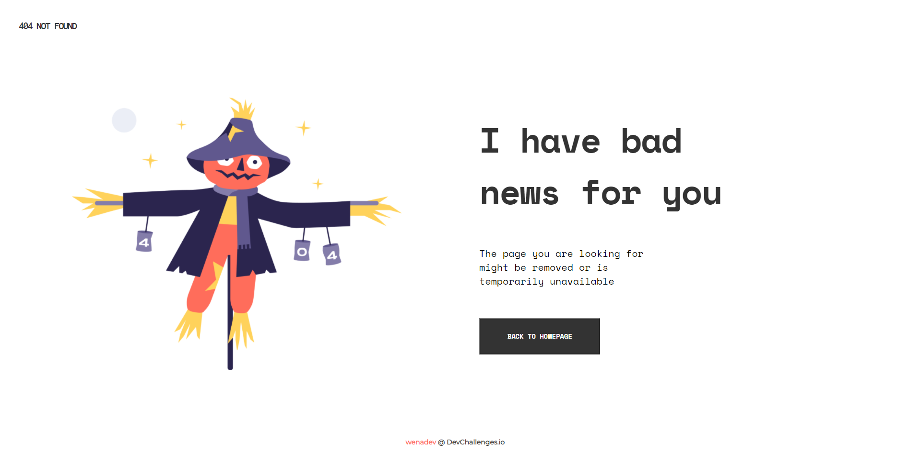

<h1 align="center">{404 Not Found}</h1>

   Solution for a challenge from  <a href="http://devchallenges.io" target="_blank">Devchallenges.io</a>.

  <h3>
    <a href="https://not-found-9b71a.web.app/">
      Demo
    </a>
     | 
    <a href="https://github.com/wenadev/devchallenges-io/tree/main/Responsive/404-not-found">
      Solution
    </a>
     | 
    <a href="https://devchallenges.io/challenges/wBunSb7FPrIepJZAg0sY">
      Challenge
    </a>
  </h3>

<!-- TABLE OF CONTENTS -->

## Table of Contents

- [Overview](#overview)
  - [Built With](#built-with)
- [Features](#features)
- [Acknowledgements](#acknowledgements)
- [Contact](#contact)

<!-- OVERVIEW -->

## Overview

### Built With

<!-- This section should list any major frameworks that you built your project using. Here are a few examples.-->

- HTML
- CSS

## Features

<!-- List the features of your application or follow the template. Don't share the figma file here :) -->

This application/site was created as a submission to a [DevChallenges](https://devchallenges.io/challenges) challenge. The [challenge](https://devchallenges.io/challenges/wBunSb7FPrIepJZAg0sY) was to build an application to complete the given user stories.

## Acknowledgements

<!-- This section should list any articles or add-ons/plugins that helps you to complete the project. This is optional but it will help you in the future. For exmpale -->

- [How To Create a Responsive Text](https://www.w3schools.com/howto/howto_css_responsive_text.asp)
- [Auto-Sizing Columns in CSS Grid: `auto-fill` vs `auto-fit`](https://css-tricks.com/auto-sizing-columns-css-grid-auto-fill-vs-auto-fit/)

## Contact

- GitHub [@wenadev](https://{https://github.com/wenadevhttps://github.com/wenadev})
- Twitter [@mawuennaa](https://{https://twitter.com/mawuennaa})
